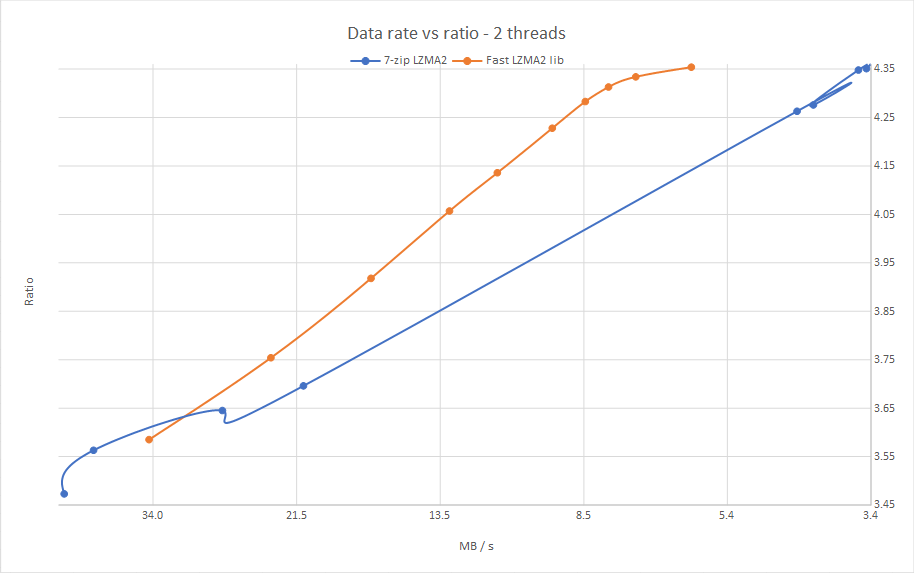

The __Fast LZMA2 Library__ is a lossless high-ratio data compression library based on Igor Pavlov's LZMA2 codec from 7-zip.

Binaries of 7-Zip forks which use the algorithm are available in the [7-Zip-FL2 project] and the [7-Zip-zstd project]. The library
is also embedded in a fork of XZ Utils, named [FXZ Utils].

[7-Zip-FL2 project]: https://github.com/conor42/7-Zip-FL2/releases/
[7-Zip-zstd project]: https://github.com/mcmilk/7-Zip-zstd/releases/
[FXZ Utils]: https://github.com/conor42/fxz

The library uses a parallel buffered radix match-finder and some optimizations from Zstandard to achieve a 20% to 100%
speed gain at the higher levels over the default LZMA2 algorithm used in 7-zip, for a small loss in compression ratio. Speed gains
depend on the nature of the source data. The library also uses some threading, portability, and testing code from Zstandard.

Use of the radix match-finder allows multi-threaded execution employing a simple threading model and with low memory usage. The
library can compress using many threads without dividing the input into large chunks which require the duplication of the
match-finder tables and chains. Extra memory used per thread is typically no more than a few megabytes.

The largest caveat is that the match-finder is a block algorithm, and to achieve about the same ratio as 7-Zip requires double the
dictionary size, which raises the decompression memory usage. By default it uses the same dictionary size as 7-Zip, resulting in
output that is larger by about 1%-5% of the compressed size. A high-compression option is provided to select parameters which
achieve higher compression on smaller dictionaries. The speed/ratio tradeoff is less optimal with this enabled.

Here are the results of an in-memory benchmark using two threads on the [Silesia compression corpus] vs the 7-zip 19.00 LZMA2
encoder. The design goal for the encoder and compression level parameters was to move the line as far as possible toward the top
left of the graph. This provides an optimal speed/ratio tradeoff.

[Silesia compression corpus]: http://sun.aei.polsl.pl/~sdeor/index.php?page=silesia

Compression data rate vs ratio
------------------------------

## Build

### Windows

The build\VS folder contains a solution for VS2015. It includes projects for a benchmark program, fuzz tester, file compression
tester, and DLL.

### POSIX

Run `make` in the root directory to build the shared library, then `make install` to allow other programs to use the headers and
libfast-lzma2. Use `make test` to build the file compression tester and run it on a test file.

The bench, fuzzer and test directories have makefiles for these programs. The CMake file present in earlier releases does not
have an installation script so is not currently included.

If a build fails on any system please open an issue on github.

[FXZ Utils] provides a derivative of liblzma from XZ Utils as a wrapper for Fast LZMA2. It is built using GNU autotools.

## Status

The library has passed long periods of fuzz testing, and testing on file sets selected at random in the Radyx file archiver. An
earlier version was released in the 7-Zip forks linked above. The library is considered suitable for production environments.
However, no warranty or fitness for a particular purpose is expressed or implied.

Changes in v1.0.1:

- The root makefile for GNU make now builds and installs a shared library and headers.
- Fixed a potential crash on memory allocation failure during structure allocations for multi-threaded decoding.
- Added a file compression test program.
- Renamed the VS DLL project and some structures / types.
- Removed some duplicated typedefs.

Changes in v1.0.0:

- Breaking changes have been made to the API functions.
- Some of the options have been renamed.
- Optimized the encoder, incorporating some of Igor Pavlov's improvements to 7-Zip 18.05, and some novel ones. The speed increase is
  about 5% - 8%.
- Moved detection of repeats from the single-threaded initialization stage to a later, multi-threaded stage to increase speed.
- Removed two compression levels, reducing the total to 10, and tweaked the parameters.
- Improved calculation of the match buffer size. It can still be changed in the options, but the meaning of the value is different.
- Replaced the callbacks for writing and progress with timeouts and new functions to gain direct access to the dictionary buffer and
  the compressed data buffers.
- Added Igor Pavlov's assembler-optimized decoder.
- Multi-threaded decompression.

Changes in v0.9.2:

- Fixed excess memory allocation when the dictionary size is > 64Mb

Changes in v0.9.1:

- Fixed a bug in compression of very small files when using a high search depth.
- Added an incompressibility checker which processes high-entropy (e.g. encrypted or already compressed) data about twice as fast
  as before.

## License

Fast LZMA2 is dual-licensed under [BSD](LICENSE) and [GPLv2](COPYING).
